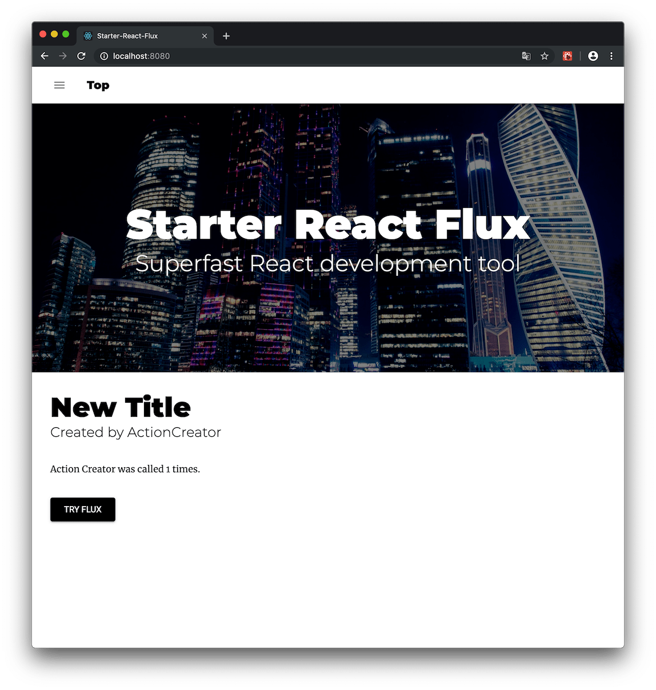

# starter-react-flux

[](https://travis-ci.org/SokichiFujita/starter-react-flux)
[](https://www.npmjs.com/package/starter-react-flux)
[](https://www.npmjs.com/package/starter-react-flux)
[](https://www.npmjs.com/package/starter-react-flux)
[](https://www.npmjs.com/package/starter-react-flux)
[](https://github.com/SokichiFujita/starter-react-flux/blob/master/LICENSE)
[](https://www.npmjs.com/package/starter-react-flux)
[](https://github.com/SokichiFujita/starter-react-flux/blob/master/README.md)

A simple and clean starter kit to develop a [React](https://reactjs.org/) project that supports [Progressive Web App](https://developers.google.com/web/progressive-web-apps/) (PWA) features.



This tool doesn't contain any blackbox npm scripts and libraries only for starter-kit. It's completely the same as the React project from scratch. You can learn fundamental mechanisms of a React and Flux project.

## Using libraries

* [React](http://facebook.github.io/react/)
* [Flux](https://facebook.github.io/flux/)
* [React-Router v4](https://reacttraining.com/react-router/)
* [Material-UI v3](http://www.material-ui.com)
* [Workbox](https://developers.google.com/web/tools/workbox/)
* [Babel 7](https://babeljs.io)
  * [@babel/preset-react](http://babeljs.io/docs/plugins/preset-react/)
  * [@babel/preset-env](https://babeljs.io/docs/plugins/preset-env/)
  * [Experimental Plugins](https://babeljs.io/docs/en/plugins#experimental)
* [Webpack v4](https://webpack.js.org)
  * [Webpack-Dev-Server](https://webpack.github.io/docs/webpack-dev-server.html)
  * [HTML-Webpack-Plugin](https://github.com/jantimon/html-webpack-plugin)
  * [Workbox-Webpack-Plugin](https://developers.google.com/web/tools/workbox/modules/workbox-webpack-plugin)
  * [Webpack-PWA-Manifest](https://github.com/arthurbergmz/webpack-pwa-manifest)
  * [Webpack Bundle Analyzer](https://github.com/webpack-contrib/webpack-bundle-analyzer)
  * [Webpack Bundle Size Analyzer](https://github.com/robertknight/webpack-bundle-size-analyzer)
* [Prettier](https://prettier.io)
* [ESLint v5](http://eslint.org)
  * [Airbnb JavaScript Style Guide](https://github.com/airbnb/javascript)
* [Jest](https://facebook.github.io/jest/)
* [Axios](https://github.com/mzabriskie/axios)
* [Immutable.js](https://facebook.github.io/immutable-js/)

## Usage

### Create a new project

```
mkdir my-app && cd my-app

//npm >= 5.2.0
npx starter-react-flux init

//npm < 5.2.0
npm install -g starter-react-flux
starter-react-flux init
```

### Launch the application

```
npm start                     // Launch the app with webpack-dev-server.
```

#### Top page


### Production build with Webpack

```
npm run build                 // Build the app into the ./public directory.
```

This command also analyzes the bundle file using Webpack Bundle Analyzer and generates reports.


### Testing with Jest

```
npm test                      // Testing with Jest.
npm run update_test           // Update snapshot testing.
```

### Static analysis with ESLint

```
npm run lint                  // Check the code by ESLint with AirBnb's style guideline.
```

### Automatic code format with Prettier

```
npm run fix                   // Fix the code by Prettier with AirBnb's guidline.
```

## Directory structure of the generated app

```
.
├── .babelrc          //Configuration for Babel
├── .eslintrc         //Configuration for ESLint
├── __tests__         //Test files for JEST
├── app
│   ├── App.js        //Entry point to build
│   ├── actions       //Action Creators of Flux
│   ├── components    //React Components
│   ├── constants     //Constatns for Action Creators and Stores of Flux
│   ├── dispatcher    //Dispatcher of Flux
│   ├── stores        //ReduceStore of Flux
│   ├── utils         //Utils
│   ├── html          //HTML template for PWA
│   ├── icon          //Icon source for PWA
│   ├── sw.js         //ServiceWorker template for PWA
│   └── utils         //Utils
├── node_modules
├── package.json
├── public            //`npm run build` command generates the assets
│   ├── css           //CSS files
│   ├── img           //Image files
│   ├── favicon.ico   //Favicon
│   ├── bundle.js     //Built js by Webpack
│   ├── manifest.*.json  //Generated Web App Manifest
│   ├── precache-manifest.*.js //Generated Precache Manifest for Workbox
│   ├── icon_*.png    //Generated icons from the source icon
│   ├── sw.js         //Generated ServiceWorker from the template
│   └── index.html    //Generated index.html from the template
├── analysis          //Reports of bundle analysis
│   ├── bundle-analyzer.html
│   └── bundle-size analyzer.log
│── webpack.common.js //Configuration for Webpack
│── webpack.prod.js   //Production configuration for Webpack
└── webpack.dev.js    //Development configuration for Webpack
```

## Current Packages

### 3.19, 2019

```
  "devDependencies": {
    "@babel/cli": "^7.2.3",
    "@babel/core": "^7.3.4",
    "@babel/plugin-proposal-class-properties": "^7.3.4",
    "@babel/plugin-proposal-decorators": "^7.3.0",
    "@babel/plugin-proposal-do-expressions": "^7.2.0",
    "@babel/plugin-proposal-export-default-from": "^7.2.0",
    "@babel/plugin-proposal-export-namespace-from": "^7.2.0",
    "@babel/plugin-proposal-function-bind": "^7.2.0",
    "@babel/plugin-proposal-function-sent": "^7.2.0",
    "@babel/plugin-proposal-json-strings": "^7.2.0",
    "@babel/plugin-proposal-logical-assignment-operators": "^7.2.0",
    "@babel/plugin-proposal-nullish-coalescing-operator": "^7.2.0",
    "@babel/plugin-proposal-numeric-separator": "^7.2.0",
    "@babel/plugin-proposal-optional-chaining": "^7.2.0",
    "@babel/plugin-proposal-pipeline-operator": "^7.3.2",
    "@babel/plugin-proposal-private-methods": "^7.3.4",
    "@babel/plugin-proposal-throw-expressions": "^7.2.0",
    "@babel/plugin-syntax-dynamic-import": "^7.2.0",
    "@babel/plugin-syntax-import-meta": "^7.2.0",
    "@babel/plugin-transform-runtime": "^7.3.4",
    "@babel/preset-env": "^7.3.4",
    "@babel/preset-react": "^7.0.0",
    "babel-eslint": "^10.0.1",
    "babel-jest": "^24.5.0",
    "babel-loader": "^8.0.5",
    "eslint": "^5.15.2",
    "eslint-config-airbnb": "^17.1.0",
    "eslint-config-prettier": "^4.1.0",
    "eslint-plugin-import": "^2.16.0",
    "eslint-plugin-jsx-a11y": "^6.2.1",
    "eslint-plugin-prettier": "^3.0.1",
    "eslint-plugin-react": "^7.12.4",
    "html-webpack-plugin": "^3.2.0",
    "jest-cli": "^24.5.0",
    "prettier": "^1.16.4",
    "react-test-renderer": "^16.8.4",
    "webpack": "^4.29.6",
    "webpack-bundle-analyzer": "^3.1.0",
    "webpack-bundle-size-analyzer": "^3.0.0",
    "webpack-cli": "^3.3.0",
    "webpack-dev-server": "^3.2.1",
    "webpack-merge": "^4.2.1",
    "webpack-pwa-manifest": "^4.0.0",
    "workbox-webpack-plugin": "^4.1.1"
  },
  "dependencies": {
    "@babel/runtime": "^7.3.4",
    "@material-ui/core": "^3.9.2",
    "@material-ui/icons": "^3.0.2",
    "axios": "^0.18.0",
    "flux": "^3.1.3",
    "immutable": "^4.0.0-rc.12",
    "prop-types": "^15.5.7-alpha.1",
    "react": "^16.8.3",
    "react-dom": "^16.8.3",
    "react-router-dom": "^4.4.0"
  }
```

## License

* MIT License
