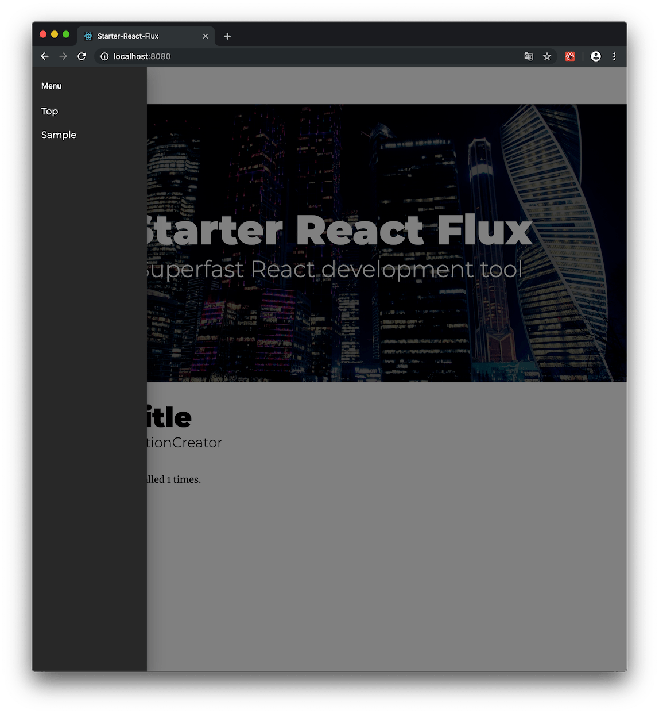

# starter-react-flux 

[](https://travis-ci.org/SokichiFujita/starter-react-flux) 
[](https://www.npmjs.com/package/starter-react-flux) 
[](https://www.npmjs.com/package/starter-react-flux) 
[](https://www.npmjs.com/package/starter-react-flux) 
[](https://www.npmjs.com/package/starter-react-flux) 
[](https://github.com/SokichiFujita/starter-react-flux/blob/master/LICENSE) 
[](https://www.npmjs.com/package/starter-react-flux) 
[](https://github.com/SokichiFujita/starter-react-flux/blob/master/README.md) 

A starter kit for a React and Flux. You can easily create a standard React and Flux project using awesome libraries.

Look ahead to the future! starter-react-flux will always install all the latest version of following libraries.

- [React](http://facebook.github.io/react/), [Flux](https://facebook.github.io/flux/)
- [Jest](https://facebook.github.io/jest/)
- [Webpack](https://webpack.js.org), [Webpack-dev-server](https://webpack.github.io/docs/webpack-dev-server.html), [Webpack Bundle Analyzer](https://github.com/webpack-contrib/webpack-bundle-analyzer)
- [Babel](https://babeljs.io), [React preset](http://babeljs.io/docs/plugins/preset-react/), [Env preset](https://babeljs.io/docs/plugins/preset-env/), [Stage 0 preset](https://babeljs.io/docs/plugins/preset-stage-0/)
- [ESLint](http://eslint.org), [Airbnb JavaScript Style Guide](https://github.com/airbnb/javascript)
- [React-Router](https://reacttraining.com/react-router/)
- [Immutable.js](https://facebook.github.io/immutable-js/)
- [Material-UI](http://www.material-ui.com)
- [Axios](https://github.com/mzabriskie/axios)

## Installation

```
npm install -g starter-react-flux
```

- Please use Node.js v8.x or above.

## Usage

### Create a new project

```
mkdir my-app && cd my-app
starter-react-flux init       // Setup a new React and Flux project.
```

### Launch the application

```
npm start                     // Launch the app with webpack-dev-server.
```

#### Top page with React and Flux


#### Client side routing with React Router



#### Bundle analyzing with Webpack Bundle Analyzer

```
npm run bundle-analyze
```


#### Testing with Jest
```
npm test                      // Testing with Jest.
```


#### Static analyze with ESLint

```
npm run lint                  // Check the code by ESLint with AirBnb's style guideline.
```


#### Automatic code format with Prettier and ESLint

```
npm run fix                   // Fix the code by Prettier with AirBnb's guidline.
```


#### Production build with Webpack

```
npm run build                 // Build the app into the ./public directory.
```


### Adding optional components for React or Flux

```
starter-react-flux generate component [Component_Name]   // Generate a React Component file.
starter-react-flux generate container [Container_Name]   // Generate a Container file for Flux.
starter-react-flux generate store [Store_Name]           // Generate a ReduceStore file for Flux.
starter-react-flux generate action [ActionCreators_Name] // Generate a ActionCreators file for Flux.
```

## Directory structure of the generated app

```
.
├── .babelrc          //Configuration for Babel
├── .eslintrc         //Configuration for ESLint
├── __tests__         //Test files for JEST
├── app
│   ├── App.js        //Entry point
│   ├── actions       //Action Creators
│   ├── components    //React Components
│   ├── constants     //Constatns for Action Creators and Stores
│   ├── dispatcher    //Dispatcher
│   ├── stores        //Reduced Store
│   └── utils         //Utils
├── node_modules
├── package.json
├── public            //Build assets and other assets
│   ├── css
│   ├── img
│   ├── index.html
│   └── js
└── webpack.config.js //Configuration for Webpack
```

## License

- MIT License


